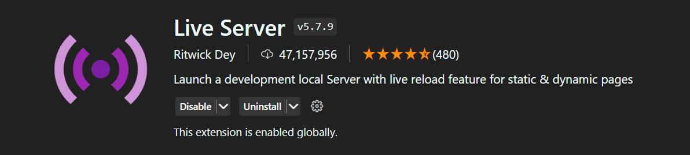
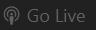

# **App for managing your plans or projects**

- **Local** for your needs
- Your plans/projects are **dragable!**
- Requires **server** (could be local)

---

## **How to run code?**

> ## Via node.js
>
> 1. [Go to nodejs.org](https://nodejs.org/en/download)
>
> 2. download the latest version available for your system
>
> 3. Open your terminal in Visual Studio Code
>
> 4. Type there: `npm install -g serve`
>    > **!** _You may need to type "sudo" on mac or linux in front of the prompt_ **!**
> 5. When downloaded, open this project and type in terminal: `serve`
> 6. Open provided link in your browser and thats it!
>    - eg ( - Local:http://localhost:3000 )

---

> ## Using Live Server extension
>
> 1. Open your Visual Studio Code
>
> 2. Find the Extensions tab ( Ctrl + Shift + X )
>
> 3. Search: Live Server ( or: "ritwickdey.LiveServer" )
>
>    
>
> 4. Install it
>
> 5. Open this project, right click on **index.html** file and choose **Open with Live Server**.  
>    Should be **_Alt +L Alt + O_** by default
>
> 6. OR click on the **Go Live** button in your status bar. In case you don't see any _Go Live_ button, double click in any place of status bar, select the _Live Server (Extension)_ and you'll see this button!
>
> 

>   

# **NEWS**

> ## **UPDATE 0.1 IS HERE**
>
> ### **What's New?**
>
> - App is still in _Beta_
> - You can activate/finish your plans
> - You can drag and drop your plans
> - Also you have more info button available
> - Added modular managment
> - Now you need a server (could be local)
> - You can now stop analytics right after loading in app(there is actually no analytics, just an example of timers, so don't worry)
> - Added new icon of the app
